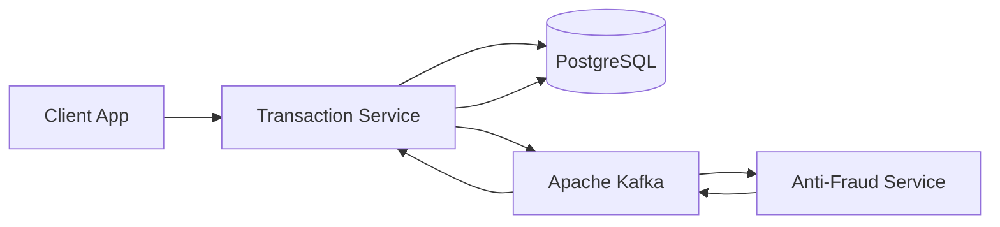

# Yape Transaction Service 🚀

**Anti-fraud transaction processing microservice for Yape code challenge**

A production-ready, scalable microservice architecture for processing financial transactions with real-time fraud detection capabilities using NestJS, PostgreSQL, and Apache Kafka.

## 🏗️ Architecture Overview



### Flow Description
1. **Transaction Creation**: Client creates transaction → Stored as "pending" in database
2. **Event Publishing**: Transaction created event published to Kafka
3. **Fraud Analysis**: Anti-fraud service processes transaction with business rules
4. **Status Update**: Anti-fraud service publishes status update (approved/rejected)
5. **Transaction Update**: Transaction service updates status in database

## 🎯 Business Rules

- ✅ All transactions start with `pending` status
- ❌ **Transactions over $1000 are automatically rejected**
- 🔍 Risk scoring based on:
  - Transaction amount (higher amounts = higher risk)
  - Transaction timing (night/weekend = higher risk)
  - Account validation (same debit/credit = higher risk)
- ⚡ Asynchronous processing with real-time status updates
- 📊 Comprehensive logging and monitoring

## 🛠️ Tech Stack

| Component | Technology | Purpose |
|-----------|------------|---------|
| **Framework** | NestJS 10 | REST API and microservice architecture |
| **Database** | PostgreSQL 14 | Transaction data persistence |
| **Messaging** | Apache Kafka | Event-driven communication |
| **Validation** | class-validator | Input validation and DTOs |
| **Documentation** | Swagger/OpenAPI | Interactive API documentation |
| **Containerization** | Docker & Docker Compose | Deployment and orchestration |
| **Language** | TypeScript | Type-safe development |

## 🚀 Quick Start

### Prerequisites
- **Required**: Docker & Docker Compose
- **Required**: curl (for testing)
- **Optional**: Node.js 18+ (for local development)
- **Optional**: jq (for automated testing with shell scripts)
  - macOS: `brew install jq`
  - Ubuntu/Debian: `sudo apt-get install jq`
  - Windows: Download from [https://stedolan.github.io/jq/](https://stedolan.github.io/jq/)
  - Alternative: Use Python 3 (usually pre-installed) for JSON parsing

### 1. Clone and Deploy
```bash
git clone https://github.com/yaperos/app-nodejs-codechallenge.git
cd yape-test
./scripts/deploy.sh
```

### 2. Verify Deployment
```bash
# Check service health
curl http://localhost:3000/health

# View API documentation
open http://localhost:3000/api-docs
```

### 3. Test Transaction Creation
```bash
# Create a transaction (should be approved)
curl -X POST http://localhost:3000/transactions \
  -H "Content-Type: application/json" \
  -d '{
    "accountExternalIdDebit": "550e8400-e29b-41d4-a716-446655440000",
    "accountExternalIdCredit": "550e8400-e29b-41d4-a716-446655440001",
    "tranferTypeId": 1,
    "value": 120.50
  }'

# Create a high-value transaction (should be rejected)
curl -X POST http://localhost:3000/transactions \
  -H "Content-Type: application/json" \
  -d '{
    "accountExternalIdDebit": "550e8400-e29b-41d4-a716-446655440000",
    "accountExternalIdCredit": "550e8400-e29b-41d4-a716-446655440001",
    "tranferTypeId": 1,
    "value": 1500.00
  }'
```

## 📡 API Endpoints

### Transactions
- `POST /transactions` - Create new transaction
- `GET /transactions/{id}` - Get transaction by ID

### Monitoring
- `GET /` - Service information
- `GET /health` - Health check with dependency status
- `GET /metrics` - System metrics (CPU, memory, uptime)
- `GET /api-docs` - Interactive API documentation

## 🔧 Development

### Local Development Setup
```bash
# Install dependencies
npm install

# Start infrastructure (PostgreSQL + Kafka)
docker-compose up -d postgres zookeeper kafka

# Set up database
npm run seed

# Start development server
npm run start:dev
```

### Available Scripts
```bash
npm run start:dev      # Development with hot reload
npm run build          # Build for production
npm run test           # Run unit tests
npm run test:e2e       # Run end-to-end tests
npm run seed           # Seed database with initial data
npm run lint           # Run ESLint
```

## 📊 Monitoring & Observability

### Health Checks
- **Database connectivity**: PostgreSQL connection status
- **Kafka connectivity**: Message broker availability
- **Service metrics**: Memory, CPU, uptime tracking

### Logging Features
- 🔍 Request/response logging with correlation IDs
- 🛡️ Sensitive data sanitization
- ⏱️ Performance timing and metrics
- 🚨 Error tracking with stack traces
- 📊 Structured logging for monitoring tools

### Error Handling
- Global exception filter with correlation IDs
- Standardized error response format
- Request timeout protection (30s)
- Comprehensive input validation

## 🐳 Docker Configuration

### Services
- **postgres**: PostgreSQL 14 with automatic schema creation
- **zookeeper**: Apache Zookeeper for Kafka coordination
- **kafka**: Apache Kafka message broker with auto-topic creation
- **transaction-service**: Main API service
- **anti-fraud-service**: Fraud detection microservice

### Volumes & Networks
- Persistent PostgreSQL data storage
- Isolated network for service communication
- Health checks for all services

## 🔐 Security Features

- Input validation with custom validators
- SQL injection prevention via TypeORM
- CORS configuration for production
- Request timeout protection
- Sensitive data sanitization in logs
- UUID v4 validation for account IDs

## 📈 Performance Optimizations

- Database indexing for common queries
- Connection pooling for PostgreSQL
- Kafka partitioning for scalability
- Async processing for fraud detection
- Memory-efficient logging
- Docker multi-stage builds

## 🧪 Testing

### Test a Complete Flow

#### Option 1: Manual Testing (No dependencies required)
```bash
# 1. Create transaction and copy the transactionExternalId from response
curl -X POST http://localhost:3000/transactions \
  -H "Content-Type: application/json" \
  -d '{
    "accountExternalIdDebit": "550e8400-e29b-41d4-a716-446655440000",
    "accountExternalIdCredit": "550e8400-e29b-41d4-a716-446655440001",
    "tranferTypeId": 1,
    "value": 120.50
  }'

# 2. Copy the transactionExternalId from above response and replace YOUR_TRANSACTION_ID
curl http://localhost:3000/transactions/YOUR_TRANSACTION_ID

# 3. Wait a few seconds for anti-fraud processing

# 4. Check final status (should be "approved" or "rejected")
curl http://localhost:3000/transactions/YOUR_TRANSACTION_ID
```

#### Option 2: Automated Testing (Requires jq)
```bash
# Install jq first (if not available):
# macOS: brew install jq
# Ubuntu/Debian: sudo apt-get install jq
# Windows: Download from https://stedolan.github.io/jq/

# 1. Create transaction
TRANSACTION_ID=$(curl -s -X POST http://localhost:3000/transactions \
  -H "Content-Type: application/json" \
  -d '{
    "accountExternalIdDebit": "550e8400-e29b-41d4-a716-446655440000",
    "accountExternalIdCredit": "550e8400-e29b-41d4-a716-446655440001",
    "tranferTypeId": 1,
    "value": 120.50
  }' | jq -r '.transactionExternalId')

# 2. Check initial status (should be "pending")
curl http://localhost:3000/transactions/$TRANSACTION_ID

# 3. Wait a few seconds for anti-fraud processing
sleep 5

# 4. Check final status (should be "approved" or "rejected")
curl http://localhost:3000/transactions/$TRANSACTION_ID
```

#### Option 3: Using Python (Alternative to jq)
```bash
# 1. Create transaction and extract ID using Python
TRANSACTION_ID=$(curl -s -X POST http://localhost:3000/transactions \
  -H "Content-Type: application/json" \
  -d '{
    "accountExternalIdDebit": "550e8400-e29b-41d4-a716-446655440000",
    "accountExternalIdCredit": "550e8400-e29b-41d4-a716-446655440001",
    "tranferTypeId": 1,
    "value": 120.50
  }' | python3 -c "import sys, json; print(json.load(sys.stdin)['transactionExternalId'])")

# 2. Check transaction status
curl http://localhost:3000/transactions/$TRANSACTION_ID
```

### Test Different Scenarios

#### Low Value Transaction (Should be Approved)
```bash
curl -X POST http://localhost:3000/transactions \
  -H "Content-Type: application/json" \
  -d '{
    "accountExternalIdDebit": "550e8400-e29b-41d4-a716-446655440000",
    "accountExternalIdCredit": "550e8400-e29b-41d4-a716-446655440001",
    "tranferTypeId": 1,
    "value": 120.50
  }'
```

#### High Value Transaction (Should be Rejected)
```bash
curl -X POST http://localhost:3000/transactions \
  -H "Content-Type: application/json" \
  -d '{
    "accountExternalIdDebit": "550e8400-e29b-41d4-a716-446655440000",
    "accountExternalIdCredit": "550e8400-e29b-41d4-a716-446655440001",
    "tranferTypeId": 1,
    "value": 1500.00
  }'
```

#### Same Account Transfer (Should be Rejected)
```bash
curl -X POST http://localhost:3000/transactions \
  -H "Content-Type: application/json" \
  -d '{
    "accountExternalIdDebit": "550e8400-e29b-41d4-a716-446655440000",
    "accountExternalIdCredit": "550e8400-e29b-41d4-a716-446655440000",
    "tranferTypeId": 1,
    "value": 500.00
  }'
```

### Unit Tests
```bash
# Run all tests
npm test

# Run tests with coverage
npm run test:cov

# Run tests in watch mode
npm run test:watch
```

## 🔄 Event-Driven Architecture

### Kafka Topics
- **transaction-created**: Published when new transactions are created
- **transaction-status-updated**: Published when fraud analysis completes

### Message Schema
```json
// Transaction Created Event
{
  "transactionExternalId": "uuid",
  "accountExternalIdDebit": "uuid",
  "accountExternalIdCredit": "uuid",
  "tranferTypeId": 1,
  "value": 120.50,
  "createdAt": "2024-01-15T10:30:00Z"
}

// Transaction Status Updated Event
{
  "transactionExternalId": "uuid",
  "status": "approved|rejected",
  "reason": "string",
  "updatedAt": "2024-01-15T10:30:30Z"
}
```

## 🚨 Troubleshooting

### Common Issues

**Service not starting?**
```bash
# Check logs
docker-compose logs transaction-service

# Verify infrastructure
docker-compose ps
```

**Database connection issues?**
```bash
# Check PostgreSQL logs
docker-compose logs postgres

# Verify database
docker-compose exec postgres psql -U postgres -d yape_transactions -c "\dt"
```

**Kafka connection issues?**
```bash
# Check Kafka logs
docker-compose logs kafka

# List topics
docker-compose exec kafka kafka-topics --list --bootstrap-server localhost:9092
```

## 📝 Additional Notes

### High-Volume Considerations
For high-volume scenarios mentioned in the optional requirements:

1. **Database Scaling**: 
   - Read replicas for query distribution
   - Partitioning by date/account for large tables
   - Connection pooling optimization

2. **Kafka Scaling**:
   - Multiple partitions for parallel processing
   - Consumer groups for horizontal scaling
   - Message compression for throughput

3. **Caching Strategy**:
   - Redis for frequently accessed data
   - Application-level caching for static data
   - Database query result caching

## 📄 License

This project is licensed under the MIT License - see the [LICENSE](LICENSE) file for details.

---

**Built with ❤️ for the Yape Code Challenge**
